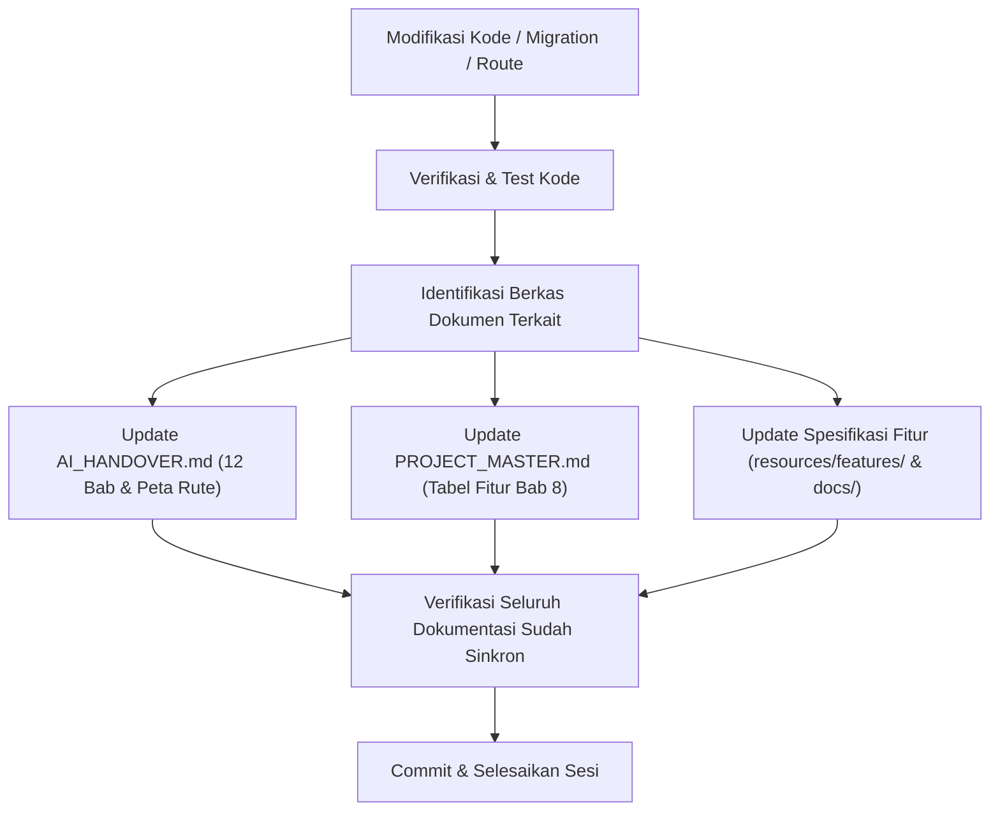

# 📚 Auto Documentation Update Skill

Skill ini mewajibkan dan memberikan panduan bagi agen AI dan pengembang untuk secara otomatis memperbarui berkas dokumentasi Markdown (`.md`) di repositori proyek setiap kali melakukan modifikasi kode, penambahan fitur, perubahan database, penambahan rute, atau refactoring.

---

## 🎯 Kapan Skill Ini Harus Diaktifkan?

Aktifkan dan jalankan prosedur di skill ini **SETIAP KALI** Anda:
1. Menambah, mengubah, atau menghapus rute (`routes/web.php`, `routes/sipat.php`, `routes/erandis.php`, `routes/elabel.php`).
2. Menambah atau mengubah migrasi, tabel, atau kolom di database MySQL/MariaDB/PostgreSQL.
3. Menambah atau mengubah Controller, Service, Model, FormRequest, Observer, atau Helper.
4. Menambah dependency/package baru, konvensi visual, library frontend (Leaflet, mPDF, dsb), atau integrasi AI/SSO.
5. Menyelesaikan tahapan atau fitur baru pada platform SIPAT Terpadu.

---

## 📋 Pemetaan Bagian Dokumen yang Wajib Diperbarui

### 1. `AI_HANDOVER.md` (Single Source of Truth)
Selaraskan dengan struktur **12 Bab Terstandarisasi**:
- **Bab 1 (Environment & Tech Stack):** Tambahkan library, package, variabel `.env`, atau model AI baru.
- **Bab 2 (Arsitektur Keamanan & Multi-Tenancy):** Catat aturan hak akses role, isolasi tenant (`opd_id`/`sipat_opd_id`), atau middleware baru.
- **Bab 3 (Integritas Data & Relasi Lintas Modul):** Catat aturan sinkronisasi dua arah, relasi kanonikal, atau guard dependensi anti-cascade delete.
- **Bab 4 (Sistem Audit Trail Terpadu):** Catat model yang dipantau log aktivitas dan penanganan diff `old_data` vs `new_data`.
- **Bab 5 (Performa & Caching):** Catat key cache baru dan pemicu invalidasi terarah (*targeted invalidation*).
- **Bab 6 (Skema Database Utama):** Tambahkan skema tabel baru lengkap dengan relasi dan indeks.
- **Bab 7 (Backend Architecture & Services):** Catat Service, Strategy Laporan, atau FormRequest baru.
- **Bab 8 (Standardisasi Laporan & Ekspor):** Catat format kolom cetak, penata letak kop surat, atau optimasi mPDF/Excel.
- **Bab 9 (Design System & Standar UI/UX):** Catat penambahan komponen SCSS atau utilitas visual baru.
- **Bab 10 (Peta Fitur Penuh):** Tambahkan rincian narasi fitur baru pada sub-modul yang relevan.
- **Bab 11 (Peta Rute Aplikasi):** Tambahkan baris baru pada tabel rute (Modul, Metode, URI, Controller@Method, Hak Akses, Keterangan).

### 2. `PROJECT_MASTER.md` (High-Level Architecture Master)
- **Bab 2 (Tech Stack):** Tambahkan package atau engine baru yang digunakan.
- **Bab 3 (System Architecture):** Catat pola desain baru jika diperkenalkan (Service, Strategy, Hub).
- **Bab 5 (Database Architecture):** Tambahkan ringkasan relasi tabel baru.
- **Bab 8 (Existing Features):** Masukkan fitur baru ke sub-tabel yang sesuai (**8.1 E-RANDIS**, **8.2 SIPAT**, **8.3 eLABEL**, **8.4 Portal Terpadu/AI**, atau **8.5 Administrasi**) dengan status `DONE`.

### 3. `ATURAN_PENAMBAHAN_FITUR.md` (Protokol & Checklist Pengembang)
- Selalu jadikan acuan protokol sebelum menulis kode fitur baru.
- Jika ada konvensi baru yang disepakati (misal: penambahan role baru atau standar audit baru), perbarui aturan terkait pada checklist FASE 2 & FASE 3.

### 4. Berkas Spesifikasi Fitur Terkait
- **Spesifikasi Fitur:** `resources/features/[nama-fitur]/requirements.md` (Tandai checklist acceptance criteria `[x]`).
- **Dokumentasi Detail Fitur:** `docs/FITUR_[NAMA].md` (Catat petunjuk penggunaan dan rincian teknis).

---

## 🔄 Alur Pembaruan Dokumentasi (Workflow)

---

## 🚨 Aturan Kritis Pembaruan
1. **Jangan Menunda Pembaruan:** Dilarang mengakhiri sesi kerja sebelum seluruh berkas `.md` yang relevan telah diperbarui dan sinkron.
2. **Kesesuaian Bab:** Pastikan penambahan informasi pada `AI_HANDOVER.md` tepat berada di bab yang sesuai dengan struktur 12 bab terbaru.
3. **Integritas Rute & Database:** Setiap kali ada rute baru di `routes/` atau migrasi baru di `database/migrations/`, tabel rute di Bab 11 dan skema di Bab 6 `AI_HANDOVER.md` wajib langsung dimutakhirkan.
4. **Bahasa Baku & Konsisten:** Gunakan Bahasa Indonesia formal dan format Markdown GitHub yang rapi.
