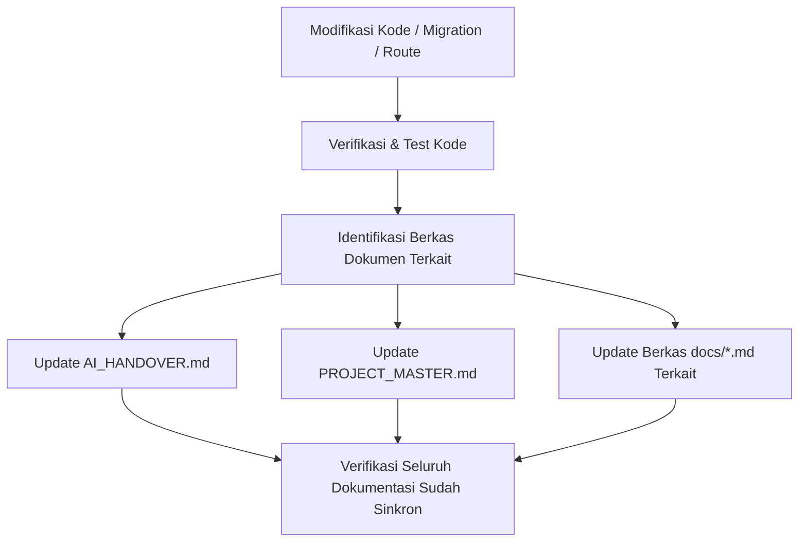

# 📚 Auto Documentation Update Skill

Skill ini mewajibkan dan memberikan panduan bagi agen AI untuk secara otomatis memperbarui berkas dokumentasi Markdown (`.md`) di repositori proyek setiap kali melakukan modifikasi kode, penambahan fitur, perubahan database, atau refactoring.

## 🎯 Kapan Skill Ini Harus Diaktifkan?

Aktifkan dan jalankan prosedur di skill ini **SETIAP KALI** Anda:
1. Menambah, mengubah, atau menghapus rute (`routes/web.php`, `routes/sipat.php`, `routes/erandis.php`, `routes/elabel.php`).
2. Menambah atau mengubah migration, tabel, atau kolom di database MySQL/MariaDB.
3. Menambah atau mengubah Controller, Service, Model, FormRequest, Observer, atau Helper.
4. Menambah dependency/package baru, konvensi visual, atau library frontend (misalnya Leaflet, mPDF, dll).
5. Menyelesaikan langkah pengerjaan pada fitur baru yang direncanakan.

---

## 📋 Berkas Dokumentasi Utama yang Wajib Diperbarui

### 1. `AI_HANDOVER.md` (Single Source of Truth)
- **Bagian 1 (Environment & Tech Stack)**: Tambahkan library, package, atau variabel `.env` baru.
- **Bagian 3 (Skema Database Utama)**: Catat skema tabel baru atau perubahan kolom/relasi.
- **Bagian 4 (Backend Architecture)**: Catat Service, Observer, atau Controller baru beserta deskripsi fungsinya.
- **Bagian 6 (Peta Fitur Penuh)**: Tambahkan deskripsi fitur baru pada modul terkait.
- **Bagian 7 (Peta Rute Aplikasi)**: Tambahkan URI, Controller@Method, dan Hak Akses rute baru.

### 2. `PROJECT_MASTER.md`
- **Bagian 2 (Tech Stack)**: Tambahkan package/library penting yang baru digunakan.
- **Bagian 5 (Database Architecture)**: Tambahkan ringkasan tabel baru.
- **Bagian 8 (Existing Features)**: Tambahkan fitur baru ke dalam tabel status (`DONE`).

### 3. Berkas Dokumentasi Spesifikasi (`docs/*.md`)
- Update status dokumen rencana (misalnya dari *Draft* ke *Selesai Diimplementasikan*).
- Tandai checklist pengerjaan (`[x]`).

---

## 🔄 Alur Pembaruan Dokumentasi (Workflow)

---

## 🚨 Aturan Kritis Pembaruan
1. **Jangan Menunda Update**: Dilarang mengakhiri sesi sebelum berkas `.md` yang relevan telah diperbarui.
2. **Format Standar**: Pertahankan gaya penulisan, tabel Markdown, dan bahasa Indonesia baku sesuai konvensi yang sudah ada.
3. **Integritas Rute & Database**: Pastikan setiap rute baru atau perubahan kolom database langsung tercermin pada tabel rute dan skema di `AI_HANDOVER.md`.
