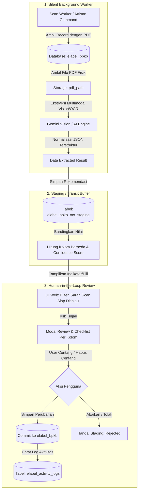

# Rencana Arsitektur & Implementasi: Silent Background OCR Staging & Selective Review BPKB

## 1. Ringkasan Eksekutif
Fitur ini dirancang untuk melakukan ekstraksi data otomatis dari seluruh berkas scan BPKB (PDF) yang **sudah tersimpan di server** tanpa intervensi manual pengguna. 
Pemindaian berjalan secara **senyap di latar belakang (silent background worker)** dan hasilnya disimpan ke dalam **tabel transit (Staging Buffer)**. Data di database utama `elabel_bpkb` **tidak akan diubah atau ditimpa secara sepihak**, melainkan menunggu peninjauan pengguna melalui **antarmuka checklist selektif**.

---

## 2. Diagram Alur Sistem (Architecture Pipeline)



---

## 3. Desain Skema Database (Staging Table)

Buat migration baru untuk tabel `elabel_bpkb_ocr_staging`:

```sql
CREATE TABLE `elabel_bpkb_ocr_staging` (
    `id` BIGINT UNSIGNED AUTO_INCREMENT PRIMARY KEY,
    `bpkb_id` INT UNSIGNED NOT NULL,
    `pdf_filename` VARCHAR(255) NOT NULL,
    `raw_extracted_json` JSON NOT NULL COMMENT 'Hasil JSON utuh dari AI Vision/OCR',
    `diff_fields_json` JSON NULL COMMENT 'Daftar kolom yang berbeda dari DB saat ini',
    `status` ENUM('pending', 'applied', 'rejected', 'failed') DEFAULT 'pending',
    `error_message` TEXT NULL,
    `reviewed_by` BIGINT UNSIGNED NULL,
    `reviewed_at` TIMESTAMP NULL,
    `created_at` TIMESTAMP NULL,
    `updated_at` TIMESTAMP NULL,
    INDEX `idx_bpkb_status` (`bpkb_id`, `status`),
    FOREIGN KEY (`bpkb_id`) REFERENCES `elabel_bpkb`(`id`) ON DELETE CASCADE
) ENGINE=InnoDB DEFAULT CHARSET=utf8mb4 COLLATE=utf8mb4_unicode_ci;
```

### Struktur Payload JSON `raw_extracted_json`:
```json
{
  "no_bpkb": "M-08123456",
  "plate_number": "DN 1234 AB",
  "no_rangka": "MH1JM3118JK123456",
  "no_mesin": "JM31E1123456",
  "merek": "HONDA",
  "tipe": "VARIO 125",
  "vehicle_type": "R2",
  "year": 2018,
  "isi_silinder": "125",
  "warna": "HITAM",
  "pengguna": "PEMERINTAH KABUPATEN SIGI"
}
```

---

## 4. Background Worker (Silent Daemon / Artisan Command)

### Command: `php artisan elabel:bpkb-scan-worker`
**Fitur Utama Command:**
1. **Targeting Spesifik**:
   - Memilih baris `elabel_bpkb` yang memiliki `pdf_path`, berstatus aktif (bukan *Dihapus*), dan belum pernah diproses di tabel staging (`status = 'pending'` atau belum ada entri).
   - Prioritaskan terlebih dahulu data yang kolom krusialnya kosong (misal `no_bpkb` atau `no_rangka` masih `NULL`).
2. **Rate Limiting & Throttling**:
   - Berikan jeda sleep (1–2 detik) antar berkas agar tidak membebani koneksi internet, CPU server, atau kuota token AI.
3. **Resilient & Error Handling**:
   - Jika satu file rusak/corrupt atau tidak terbaca, simpan status `failed` dengan error message dan lanjut ke berkas berikutnya tanpa membuat command berhenti (crash).
4. **Bisa Dijalankan via Cron / Supervisor / Task Scheduler**:
   - Dapat dijadwalkan di Laravel Scheduler (`routes/console.php`):
     ```php
     Schedule::command('elabel:bpkb-scan-worker --limit=20')->everyTenMinutes();
     ```

---

## 5. Mesin Ekstraksi (Service Layer)

Buat service `App\Services\Elabel\BpkbOcrExtractionService`:
- **Engine Utama**: Multimodal Vision via `UnifiedAiService` / `GeminiAiService` (`gemini-1.5-flash` / `gemini-2.0-flash`).
  - Mengirim byte file PDF (halaman 1–2 yang memuat faktur/identitas kendaraan).
  - Menggunakan Structured Prompt dengan skema JSON pasti.
- **Engine Fallback (Offline)**:
  - Jika koneksi luar mati, gunakan `pdftotext` (Poppler) + ekspansi Regex untuk mendeteksi minimal Plat Nomor & Nomor Rangka/Mesin yang memiliki pola baku.

---

## 6. Desain UI / UX Review (Human-in-the-Loop)

Pengguna tidak perlu melakukan scan manual. Semua hasil scan sudah tersaji saat membuka halaman BPKB:

### A. Indikator / Filter pada Halaman Utama BPKB (`elabel.bpkb.index`)
- Tambahkan pill counter di filter bar:
  `[ 💡 Saran Scan Siap Ditinjau: 57 Data ]` (Warna aksen Amber/Indigo, dapat diklik untuk memfilter baris tersebut).
- Pada baris tabel yang memiliki saran:
  - Tampilkan ikon/badge `[ ⚡ Tinjau Scan ]` di kolom aksi atau di samping nomor plat.

### B. Modal Review Komparasi & Checklist Selektif
Saat tombol `[ ⚡ Tinjau Scan ]` diklik, modal menampilkan:

1. **Bagian Kiri**: Pratinjau PDF Dokumen BPKB (Iframe / PDF Viewer) untuk verifikasi mata manusia.
2. **Bagian Kanan**: Formulir Checklist Komparasi:
   - Tombol cepat: `[ ☑️ Pilih Semua ]` | `[ ⬜ Kosongkan Pilihan ]` | `[ 🎯 Hanya Nilai Baru/Kosong ]`
   - Daftar baris checklist:
     - **Nomor BPKB**: `[DB: - ]` $\rightarrow$ `[Scan: M-08123456]` $\checkmark$ (Tercentang)
     - **Nomor Polisi**: `[DB: DN 1234 AB]` $\rightarrow$ `[Scan: DN 1234 AB]` (Sama, tanda hijau)
     - **Nomor Rangka**: `[DB: - ]` $\rightarrow$ `[Scan: MH1JM311...]` $\checkmark$ (Tercentang)
     - **Nomor Mesin**: `[DB: - ]` $\rightarrow$ `[Scan: JM31E...]` $\checkmark$ (Tercentang)
     - **Pengguna / Pemilik**: `[DB: BPKAD]` $\rightarrow$ `[Scan: PEMKAB SIGI]` $\square$ (Bisa di-uncheck)
3. **Tombol Eksekusi**:
   - `[ ✅ Terapkan & Simpan ke Database ]`: Memperbarui `elabel_bpkb` untuk kolom yang dicentang, mengubah status staging menjadi `applied`.
   - `[ ❌ Tolak / Abaikan Saran ]`: Menandai status staging menjadi `rejected`.

---

## 7. Audit Trail & Integritas Data
Setiap kali perubahan dari review staging diterapkan:
1. Memanggil `ElabelActivityLog::create()` mencatat:
   - Siapa user yang melakukan verifikasi (`reviewed_by`).
   - Kolom mana saja yang diperbarui dari saran OCR.
   - Nilai lama vs nilai baru.
2. Keamanan terjaga 100%, data transparan dan dapat ditelusuri riwayatnya (*accountability*).

---

## 8. Langkah-Langkah Eksekusi (Checklist Kesiapan)

Ketika token Anda sudah siap/terisi kembali, eksekusi dapat dilakukan secara bertahap:

- [ ] **Langkah 1**: Buat Migration `create_elabel_bpkb_ocr_staging_table` dan Model `ElabelBpkbOcrStaging`.
- [ ] **Langkah 2**: Buat Service `App\Services\Elabel\BpkbOcrExtractionService` yang menghubungkan file PDF lokal dengan Gemini Vision Structured JSON.
- [ ] **Langkah 3**: Buat Artisan Command `php artisan elabel:bpkb-scan-worker` untuk mengeksekusi scanning di latar belakang secara terkontrol.
- [ ] **Langkah 4**: Tambahkan Route & Controller Action untuk review (`index`, `apply`, `reject`).
- [ ] **Langkah 5**: Pasang komponen UI Review Modal dengan checklist selektif di view `resources/views/elabel/bpkb/index.blade.php`.
- [ ] **Langkah 6**: Pengujian sampel pada 3–5 berkas BPKB nyata untuk memastikan akurasi mapping field.
