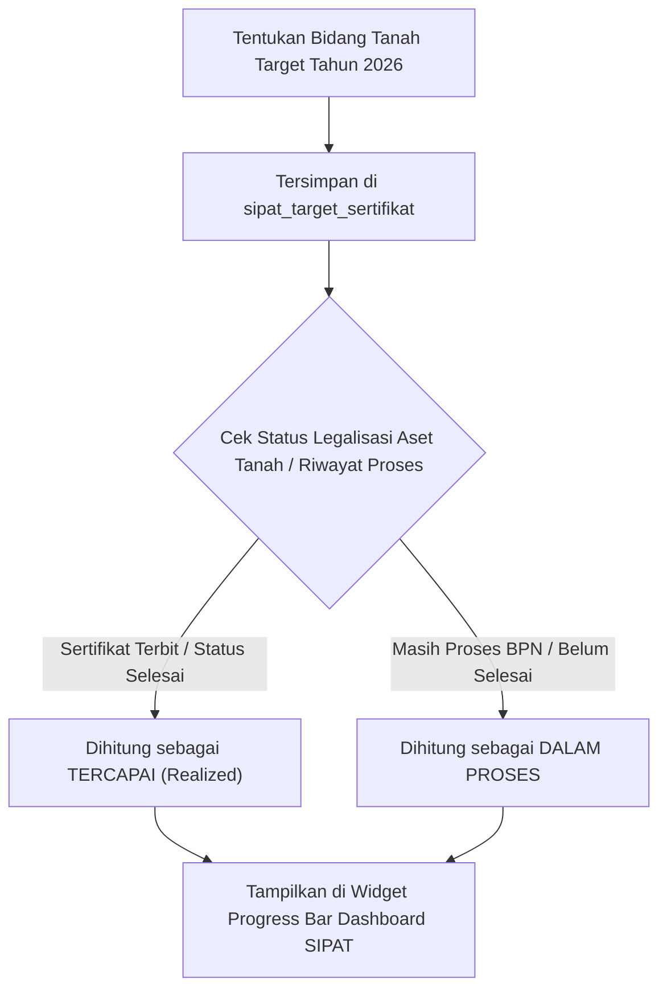

# 📜 Rencana Pengembangan Fitur Target Pensertifikatan Tanah Tahunan
## Modul SIPAT (Sistem Informasi Peralatan & Aset Terpadu)

> **Dokumen Perencanaan Teknis & Arsitektur**  
> *Tanggal Penyusunan:* 24 Agustus 2026  
> *Status:* ✅ **Selesai Diimplementasikan & Direfaktur (Branch feature/staging)**

---

## 1. Latar Belakang & Tujuan
Pemerintah Daerah (BPKAD / Bagian Aset) memiliki indikator kinerja utama (KPI) tahunan untuk mensertifikatkan bidang tanah aset daerah yang tercatat di **KIB A (Master Aset Tanah)**.

**Tujuan Fitur:**
1. Memungkinkan Admin/Pengelola Aset menetapkan target bidang tanah KIB A yang wajib diselesaikan pensertifikatannya pada tahun anggaran tertentu.
2. Menyajikan visualisasi *real-time* pencapaian target tahunan Pemda dan per-OPD.
3. Terintegrasi langsung dengan fitur **Riwayat Proses Pengurusan BPN** (`storeProses`) yang sudah ada di Modul SIPAT tanpa perlu penginputan ganda.

---

## 2. Rancangan Struktur Database (`Migration`)

Untuk menjaga kebersihan database dan menyimpan riwayat target multi-tahun, dibuat **1 tabel khusus baru**:

### Nama Tabel: `sipat_target_sertifikat`

| Nama Kolom | Tipe Data | Keterangan |
| :--- | :--- | :--- |
| `id` | `bigint` (PK, Auto Increment) | Primary Key |
| `tahun` | `integer` | Tahun Anggaran Target (contoh: `2026`) |
| `aset_tanah_id` | `unsignedBigInteger` (FK) | Relasi ke `sipat_aset_tanah.id` |
| `target_jumlah` | `integer` (Default `1`) | Kuota / Pembobotan |
| `keterangan` | `text` (Nullable) | Catatan target (misal: *Target Prioritas Aksi KPK*) |
| `created_at` | `timestamp` | Waktu Penetapan |
| `updated_at` | `timestamp` | Waktu Perubahan |

*(Catatan Refaktorisasi: Kolom `opd_id` telah dihapus dari tabel ini karena kepemilikan OPD diambil langsung melalui relasi `asetTanah->opdSipat` untuk menjamin konsistensi data).*

---

## 3. Alur Logika & Perhitungan Otomatis (`Business Logic`)

### Formulas Perhitungan:
* **Total Target (Tahun N)** = Jumlah data di `sipat_target_sertifikat` pada `tahun = N`.
* **Total Realisasi (Tercapai)** = Jumlah tanah target yang status legalitasnya sudah *Bersertifikat* atau proses BPN-nya bernilai *Selesai*.
* **Persentase Capaian** = `(Total Realisasi / Total Target) * 100%`.

---

## 4. Rancangan Antarmuka & Layar UI (`Views`)

### A. Sub-Menu Baru di Sidebar SIPAT
Lokasi: Navigasi Utama `Modul SIPAT` $\rightarrow$ `Master Aset Tanah` $\rightarrow$ **`Target Pensertifikatan`** (`/sipat/target-pensertifikatan`).

### B. Halaman Dashboard Kinerja Target (`index.blade.php`)
1. **Header Filter**: Pilihan Filter Tahun (2024, 2025, 2026, 2027) & Filter OPD.
2. **Card Summary & Progress Bar**:
   - Total Target Tahun Anggaran.
   - Realisasi Sertifikat Terbit.
   - Progress Bar Visual (Warna Hijau jika $\ge 80\%$, Kuning jika $50\% - 79\%$, Merah jika $< 50\%$).
3. **Tabel Ringkasan Target per OPD**:
   - Kolom: Nama OPD, Total Target Bidang, Realisasi, Persentase Capaian, Status Kinerja.
4. **Tabel Daftar Bidang Tanah Target**:
   - Kolom: Nama Aset/Lokasi Tanah KIB A, Nibar, OPD Pengguna, Status Proses BPN Terakhir, Indikator Capaian (Tercapai / Dalam Proses).
5. **Modal Edit & Hapus Target**: Memungkinkan pembaruan data target dan keterangan secara interaktif.
6. **Integrasi GIS Leaflet Map**: Visualisasi pemetaan interaktif lokasi aset tanah target menggunakan Leaflet JS, GeoJSON, dan Shapefile.

### C. Form Modal Penetapan Target (`Modal Form`)
- Pilih Tahun Anggaran.
- Multi-select / Pilih Bidang Tanah dari Master Aset KIB A yang belum bersertifikat.
- Tombol *"Simpan Target Tahunan"*.

---

## 5. Fitur Pelaporan & Export

1. **Export Excel Capaian Target** (`/sipat/target-pensertifikatan/export-excel`):
   Format XLSX siap cetak memuat Rekap Target vs Realisasi per OPD dan rincian tanah KIB A.
2. **Cetak PDF Laporan Kinerja** (`/sipat/target-pensertifikatan/export-pdf`):
   Dokumen resmi bertanda tangan pimpinan untuk Lampiran LAKIP / LKjIP Pemda dan Bahan Audit BPK / KPK.

---

## 6. Tahapan Eksekusi Pengkodean

- [x] **Langkah 1**: Membuat migration file `create_sipat_target_sertifikat_table`.
- [x] **Langkah 2**: Membuat Model `App\Models\Sipat\SipatTargetSertifikat` dan menentukan relasi dengan `AsetTanah`.
- [x] **Langkah 3**: Membuat Controller `App\Http\Controllers\Sipat\TargetSertifikatController` (termasuk fitur CRUD edit/update target).
- [x] **Langkah 4**: Mengonfigurasi Route di `routes/sipat.php`.
- [x] **Langkah 5**: Membuat Tampilan Blade UI di `resources/views/sipat/target_sertifikat/index.blade.php`.
- [x] **Langkah 6**: Menambahkan tautan sub-menu di Sidebar Navigasi Utama.
- [x] **Langkah 7**: Refaktor database (penghapusan `opd_id`) dan penambahan integrasi pemetaan GIS (Leaflet, Turf.js, Shp.js).

---
*Dokumen ini disimpan di: `docs/rencana_pengembangan_target_pensertifikatan_sipat.md`*
