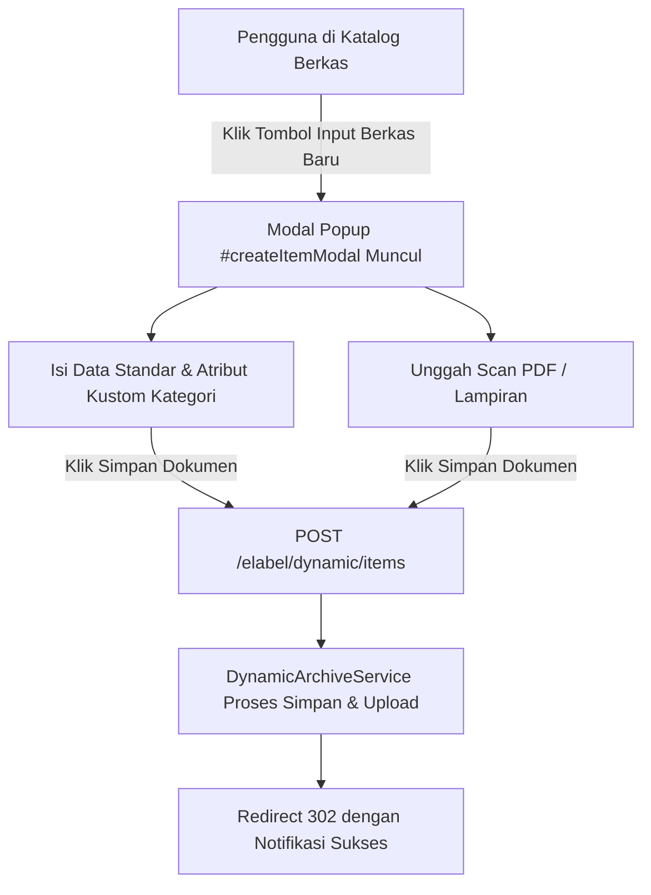

# SPESIFIKASI FITUR: MODAL INPUT BERKAS ARSIP DINAMIS (eLABEL)

## 1. Ringkasan Eksekutif
- **Nama Fitur**: Modal Input Berkas Arsip Dinamis Terintegrasi (`#createItemModal`)
- **Modul Terkait**: eLABEL (Universal Dynamic Archive Engine)
- **Tujuan Bisnis**: Menyamakan konsistensi UX di seluruh modul (SIPAT, Kendaraan, Box Arsip) agar penambahan berkas baru dapat dilakukan langsung via modal popup responsif tanpa perlu navigasi pindah halaman.
- **User Target**: Superadmin, Admin, Admin OPD
- **Tingkat Prioritas**: P1 - Tinggi

## 2. User Story
Sebagai Operator Arsip / Admin OPD / Superadmin,
Saya ingin menginput data berkas dan mengunggah scan PDF langsung melalui Modal Popup di halaman Katalog Berkas,
Sehingga proses pengarsipan menjadi cepat, efisien, dan konsisten dengan fitur Tambah Box, Tambah Kendaraan, dan Tambah Aset Tanah.

## 3. Kriteria Keberterimaan (Acceptance Criteria)
- [x] Tombol `+ Input {KODE} Baru` di toolbar dan tombol di empty state membuka modal `#createItemModal` (ukuran `modal-xl`).
- [x] Modal memuat seluruh input standar (Nomor Berkas, Nama/Uraian, Tahun, Status, OPD Pengolah, Box Fisik, File Scan PDF, Keterangan).
- [x] Modal secara otomatis merender atribut kustom dinamis (*schema fields*) sesuai kategori arsip yang aktif.
- [x] Kategori arsip otomatis terkunci sesuai kategori menu yang sedang dibuka.
- [x] Form mendukung upload berkas `multipart/form-data` hingga 20MB.
- [x] Halaman `items/create.blade.php` tetap dipertahankan sebagai fallback endpoint route.

## 4. Diagram Alur (Flowchart)

